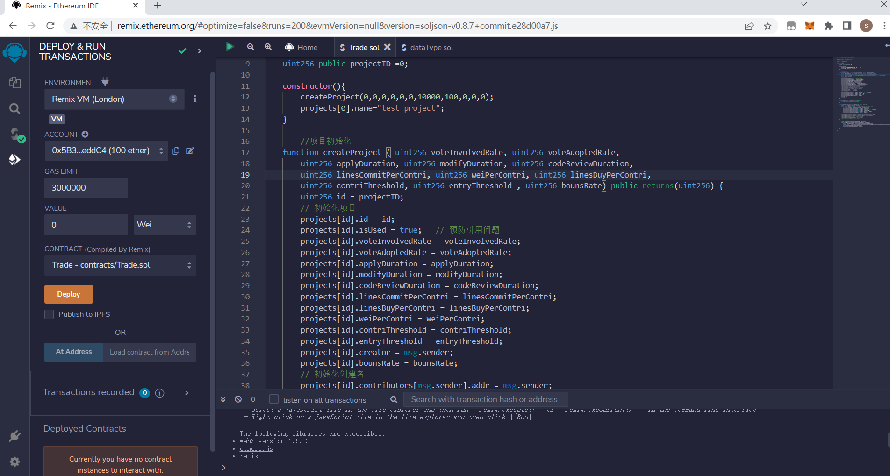
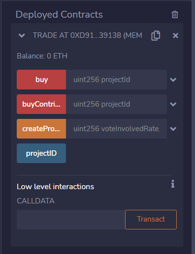
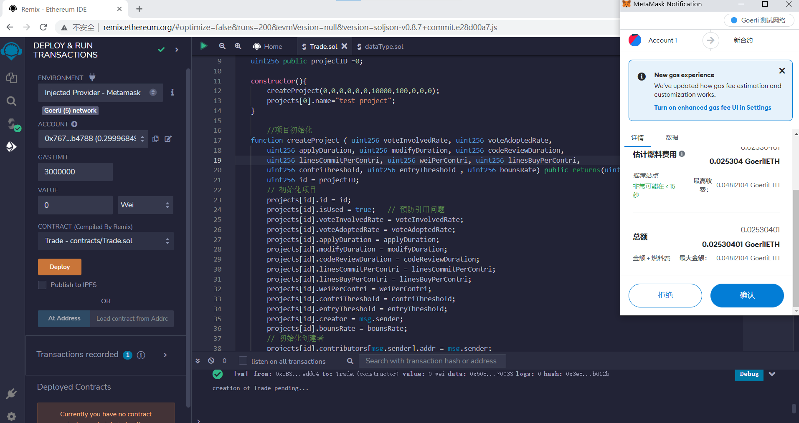
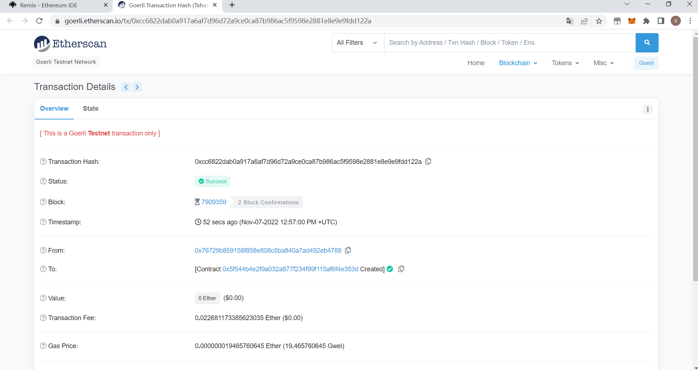
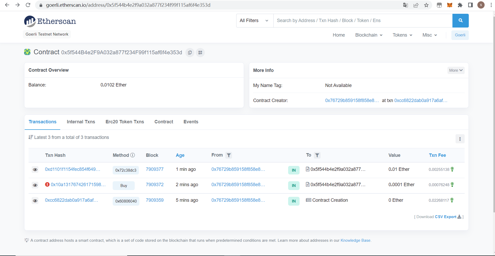

# 2022嵌入式实践课——智能合约

## 伍成恩 191250154

### 贡献度使用模块——利益分配合约

#### 前言

本次代码采用solidity语言编写，使用[remix](http://remix.ethereum.org/)在线编译器进行编译，并通过remix内置的Remix VM环境部署，最后部署Goerli以太坊测试网络上

#### 数据结构

所有使用数据结构参考了往届的代码，并放在了`./contract/dataType.sol`文件中

#### 功能实现

正式合约的文件名为`./contract/Trade.sol`，其中包含了本次实现的利益分配的功能。

##### 项目初始化

为了能够测试利益分配功能是否能够成功运行，在合约部署时会进行项目的初始化，在初始化阶段改合约会创建一个全新的代码项目，并且其项目id为0，我们设置了该项目内的关键变量，如每一个贡献度的价格和每一个贡献度能够兑换的代码行数。

##### 通过购买来加入项目并且获得贡献度

为了能够测试不同的情况下利益分配是准确，在这里我简要的写了一个加入项目并且购买贡献度的方法

##### 购买软件

该方法是用来触发利益分配方法的

##### 利益分配 *

通过计算每个人贡献度的占比来分配本次收益的80%收入，该方法涉及到以太的转发，请谨慎调用

#### 部署

##### 本地测试

通过remix自带的Remix VM即可非常快速的部署

##### 部署在测试网络——Gorlie测试网络

通过remix的Injected Provider - Metamask 来部署到测试网络上

